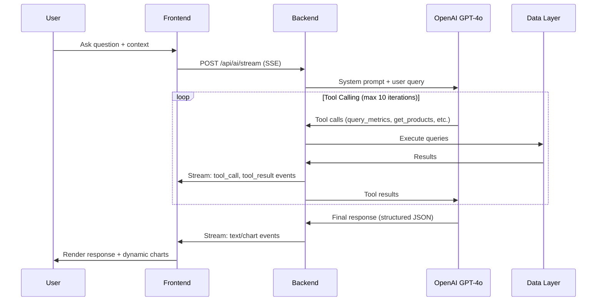

# Finance Dashboard

## Description

AI-powered financial dashboard POC that unifies fragmented financial data into a single view. Features interactive metrics visualization, multi-dimensional filtering, and a natural language AI assistant that generates custom charts on demand. Built for CFOs and finance managers who need quick insights without technical dependencies.

## Setup

### Prerequisites
- Node.js 18+
- OpenAI API key

### Installation

```bash
# Install dependencies
cd web && npm install
cd ../server && npm install

# Configure environment
echo "OPENAI_API_KEY=your-key-here" > .env
```

### Running

```bash
# Terminal 1 - Backend (port 3001)
cd server && npm run dev

# Terminal 2 - Frontend (port 3002)
cd web && npm run dev
```

Or with Docker:
```bash
docker compose up --build
```

## Features

- **KPI Dashboard**: Revenue, Gross Margin, OpEx, Net Profit, Cash Balance, Runway metrics with MoM/YoY comparison
- **Interactive Charts**: Revenue trends, product breakdown, margin analysis, stacked revenue visualization
- **Smart Filtering**: Date range presets, product multi-select, period comparison modes
- **AI CFO Assistant**: Natural language queries to generate custom visualizations (e.g., "Show me revenue trends for Q3 2024")
- **Panel Management**: Toggle visibility, persist layout, AI-generated panels saved to dashboard

## AI CFO Architecture

The AI assistant uses an iterative tool-calling pattern with OpenAI GPT-4o to answer financial questions and generate visualizations.



**Key Components:**
- **Tool Executor**: Executes `query_metrics`, `get_products`, `get_date_range` against data layer
- **Structured Output**: Response schema enforces text/chart message format with chart configs
- **SSE Streaming**: Real-time events for thinking, tool calls, results, and final response

## If I have more time...

- **Agentic Framework**: Integrate LangChain/LangGraph for multi-step reasoning, tool chaining, and autonomous data exploration
- **Database Migration**: Replace in memory storage with PostgreSQL/MongoDB for scalability and real-time updates
- **Multi-tenancy**: User authentication, role-based access, organization-level data isolation
